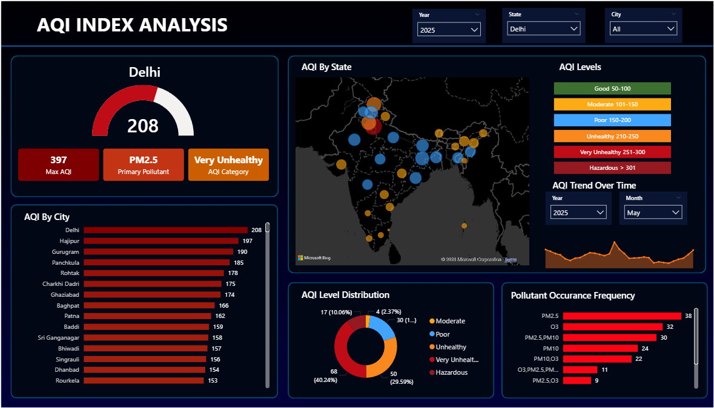
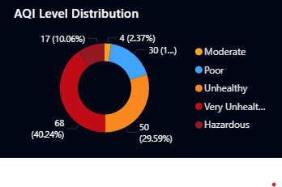
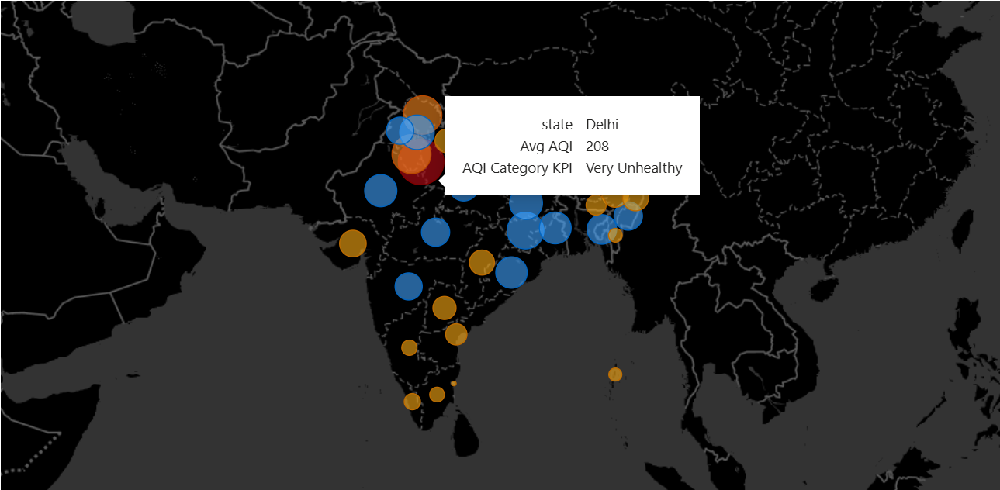

## Air Quality Index (AQI) Analysis Dashboard

# Project Overview

Air pollution has become one of the most serious environmental issues in many cities. Monitoring and understanding air quality trends is essential for improving public health and making informed policy decisions.

This project focuses on analyzing Air Quality Index (AQI) data across different cities using Power BI. The dashboard provides an interactive view of pollution levels, pollutant concentration, and city-wise comparisons to help identify patterns and high-risk areas.

## Behind the Story

Air pollution affects millions of people every day. Cities with rapid industrialization and increasing vehicle usage often experience higher pollution levels.

The goal of this project was to explore how pollution levels vary across locations and time and to present the findings through an interactive data visualization dashboard.

# Using Power BI, the data was transformed into meaningful visuals that highlight:

-Cities with the worst air quality

-Trends of AQI over time

-Distribution of major pollutants

## Tools & Technologies Used

-Power BI – Data visualization and dashboard creation

-Microsoft Excel – Data storage and preprocessing

-Data Visualization Techniques – Charts, maps, KPIs, and filters

## Key Insights

-Identifies cities with the highest pollution levels

-Shows AQI trends over time

-Compares major pollutants such as PM2.5, PM10, and NO₂

-Helps understand air quality distribution across regions

## Dashboard Preview

### Full Dashboard

 

## Conclusion

The AQI dashboard helps visualize air pollution patterns and provides useful insights into environmental conditions across cities. Such analysis can support awareness, research, and decision-making for improving air quality.
